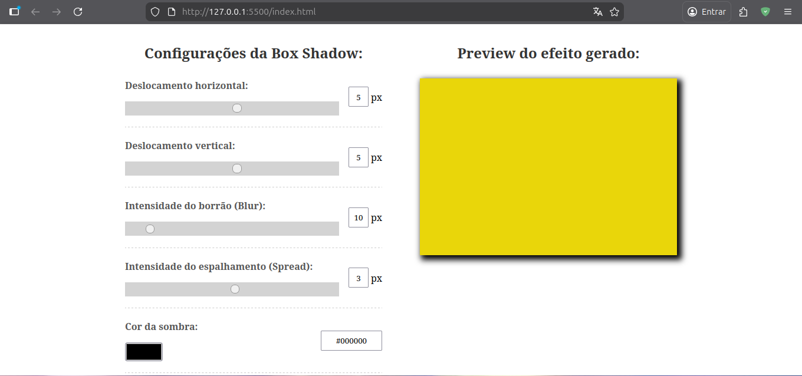
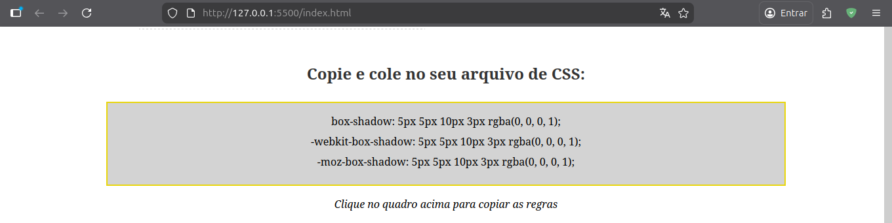

# Box Shadow Generator

A sleek and intuitive web-based tool for generating CSS `box-shadow` properties in real-time. This project allows users to customize various shadow parameters and instantly see the results on a preview element, then copy the generated CSS code.

## 🚀 Features

- **Real-time Preview**: See changes instantly as you adjust sliders.
- **Customizable Parameters**: Horizontal and vertical offset, blur, spread, color, opacity, and inset shadow.
- **Copy to Clipboard**: One-click to copy the generated CSS rules for standard, WebKit, and Moz engines.
- **Responsive Design**: Modern and clean interface that works across different screen sizes.

## 🛠️ Technologies Used

- **HTML5**: Semantic structure of the application.
- **CSS3**: Modern styling with a focus on usability and aesthetics.
- **JavaScript (ES6+)**: Dynamic logic and real-time calculation of shadow properties.

## 📁 Project Structure

```text
.
├── assets
│   ├── css
│   │   └── styles.css
│   └── js
│       └── script.js
├── index.html
└── README.md
```

## 🚀 How to Run

1. Clone or download this repository.
2. Open the `index.html` file in any modern web browser (Edge, Chrome, Firefox, Safari).
3. Start generating your box-shadow effects!

## 📸 Previews



